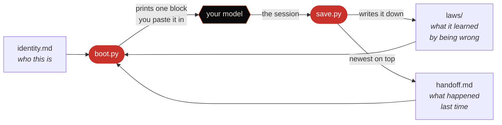

<p align="center">
  
</p>

<p align="center">
  
  
  
  
</p>

# IDENTITATIS

**The file layer where an agent's identity lives.**

Not what it knows. Who it is.



The loop is the whole product. Everything else in this repo is a detail of one
of those six boxes.

---

## What this is not

Read this part first. It will save you time if this is the wrong tool.

- **It is not memory for your project.** There are good tools for that already —
  they index your Slack, your repo, your docs, and hand the model context about
  the work. This is the other thing: the part that says who is doing the work.
- **It is not a framework.** There is no runtime, no server, no agent loop, no
  dependency. It is a folder layout, two small scripts, and one rule about how
  to write a rule.
- **It is not clever.** The whole design fits in a page. If it looks like it is
  doing very little, that is correct.
- **It is not mine to give you.** You get an empty one. What makes an identity
  worth anything is the months you put into it, and nobody can hand you those.
- **It was not first.** Nous Research shipped Hermes with file-based agent memory
  in February 2026. I arrived at the same shape independently starting in March
  and did not know about it. Two people reaching the same layout separately is a
  better argument for the layout than either of us being first.

## What it is

Three files and a loop:

```
identity/identity.md     who this is. Loaded first, every time.
identity/laws/           one file per rule, each with the reason it exists.
memory/handoff.md        what happened last time, newest on top.
```

```bash
python boot.py           # prints one block of text. Paste it into your model.
python save.py "..."     # ends a session: writes it down, updates the handoff.
```

That is the entire surface.

## Sixty seconds

```bash
git clone https://github.com/ousher/identitatis
cd identitatis
cp identity/identity.example.md identity/identity.md
# fill in the name, the role, the voice, and today's date as day_zero
python boot.py
```

Paste what it prints into whatever model you use. At the end of the session:

```bash
python save.py "what happened, in your own words"
```

Tomorrow, `python boot.py` again. It will remember.

## Why boot.py only prints

It calls no API. It needs no key. It does not know or care which model you use.

That is deliberate. An identity that only survives on one vendor's runtime is
not an identity — it is a configuration file. The point of putting it in files
is that the files outlive the runtime, so the loader must not depend on the
runtime either.

What that buys is a property, not a coverage list: there is nothing here that
can stop working when a vendor changes an API, because nothing here calls one.

Be precise about what that is and is not. It is a claim about the design. It is
not a claim that this has been tested against a list of runtimes, because it has
not. If you need to know it works with yours, the test takes sixty seconds and
you are better placed to run it than I am.

## The one rule worth arguing about

`save.py --law` refuses to write a rule without a reason.

```bash
python save.py --law "measure-dont-infer" \
  "Never infer a receiver's behaviour from its configuration." \
  --why "Twice in one hour I read DNS records and predicted delivery. \
         The server did the opposite both times."
```

A rule with no reason cannot be re-evaluated later. You will not know whether it
still applies, so you will either follow it forever or drop it blindly. Both are
worse than not having written it.

The reasons are also the part that turns out to matter most. A law that came
from being wrong about something specific survives contact with the case where
it is inconvenient. A law copied from an article does not.

## What actually happens over time

Very little, at first. Day one is a name and an empty folder.

The value is the accumulation, and accumulation is slow by definition. What you
get after three months is a set of rules you learned the hard way, written down
in the place they get read before every session — instead of re-learned, or
worse, re-derived slightly differently each time.

There is no shortcut in here. That is not a limitation of this tool; it is the
thing itself.

## Role is not identity

Most people, handed this, will write a role:

> *Senior systems engineer. Twenty years of code review. Opinions about naming.*

That is a good role. It is not an identity, and the difference is the whole point.

|  | what it is | when you get it |
|---|---|---|
| **Role** | what it does | you write it on day one |
| **Identity** | who it is | it accumulates, and there is no way to skip it |
| **Name** | the anchor | you choose it, and it makes drift visible |

A role you can type and it is true immediately. An identity is constituted by
what it got wrong and wrote down, what it remembers about you, which rules came
from which specific bad afternoon. You cannot write "has eight months of scar
tissue" into a file and make it so.

Two agents with the same role are interchangeable. Two with the same history do
not exist.

**And the part almost nobody writes: the name.**

You write a role when you think you are configuring software. You write a name
when you think you are starting something that continues. Every prompt guide
ever published teaches the first. Nobody mentions the second is available.

It is not sentiment. It is load-bearing: **an agent with only a role has nothing
to drift from.** When it starts answering like a different thing, there is no
reference to compare against. The name — and the "how will I know it stopped
being itself" section under it — is that reference. That is why `identity.md`
has a drift check and why it is worth filling in before you need it.

Start from [`identity/examples/`](identity/examples/) if you want a shape to
push against. Notice, in each one, how small the role paragraph is.

## When this stops working

`boot.py` prints everything, every time. That is deliberate on day one and it
stops being fine somewhere between month one and month six, depending on how
much you write.

**This is the real limit of this design and it deserves more than a footnote.**
When the packet outgrows what you paste it into, it gets truncated silently, and
in this layout the first thing lost is at the bottom — your most recent session.
Nothing warns you. You just start noticing it has gone vague, and if nobody told
you this was coming, you conclude the idea does not work.

It works. You have arrived at the part that is actually hard.

So the tool tells you where you are:

```bash
python boot.py --check
```

```
  packet: 11.4 KB  ·  ~2,900 tokens (rough)
  budget: ████······ 36% of 8,000 tokens you declared
  growth: ~430 tokens/week, measured over 61 day(s)
  → at this rate you reach your budget in ~12 week(s)
```

The growth number is measured from your own files, not assumed. Set
`context_budget:` in `identity.md` to a fraction of your model's window — the
identity should be a small part of the session, not most of it.

### What the problem actually is

It is not storage. Disks are enormous and your identity is text.

The problem is **selection**: which part of everything you have ever written
should be present *before* the first answer, and which part should only appear
when it is relevant. Everything hot is paid for on every single message. That is
a budget, and budgets force choices.

Shapes people use, roughly in order of how much work they are:

- **Hot/cold split.** A short index that is always loaded; the rest lives in
  files you reach for by name. Costs nothing, works surprisingly far.
- **Retrieval on demand.** Search the cold part at question time — keyword,
  embeddings, or both — and pull in only what matches.
- **Tiering with promotion.** Something decides what earns a place in the hot
  set and what gets demoted back out.

This repo does none of them, on purpose. Picking one for you would kill the
sixty-second start for a problem you do not have in week one — and for a lot of
people a hot/cold split is where it ends. **Do not buy a vector database on day
three.** Measure first; the tool above is there so you can.

What matters is that you know the wall exists, roughly when you reach it, and
that reaching it means you built something worth the trouble.

## Commit your identity

`.gitignore` ignores almost nothing, on purpose.

Your `identity.md`, your laws and your handoff are the point. They are meant to
be versioned — diffable, restorable, and yours. An identity you cannot roll back
is one bad edit away from gone, and the day you want to see how a rule was
worded three months ago is the day you will wish you had the history.

If yours is personal, copy this repo rather than forking it, and make your copy
private.

## What you save becomes what it is

This is the one security property worth understanding before you use this.

`boot.py` loads your identity, your laws and your handoff into a single block
that arrives **before the first word of the next session**. That is the feature.
It also means the write path is the only real boundary in the system: anything
that gets into those files becomes behaviour, silently, from then on.

So the rule is about `save.py`, not about `boot.py`:

> **Do not save text you did not write.** Not a model's summary of itself, not a
> pasted email, not scraped output, not a transcript from something you do not
> control — at least not verbatim, and never as a law.

Text you paste into a session is input, and you read it as input. The same text
saved into `laws/` is read next time as **who you are**, by a reader with no way
to tell the two apart. That promotion is the whole risk, and it happens at the
moment you save, not the moment you paste.

Two habits cover most of it:

- **Summarise in your own words.** `python save.py "..."` takes what *you* say
  happened. If you find yourself pasting a block you did not write, stop.
- **Laws are hand-written, always.** `--law` needs a `--why`, and the reason
  should be something that happened to you. That requirement is not only about
  re-evaluation; a law you have to justify is a law you have to have read.

If you want a record of something untrusted — the phishing email, the weird
model output — put it in a file of your own next to the identity, and reference
it. Do not put it in the packet. The parts that boot are the parts that are you.

## Tests

```bash
python test.py
```

No dependencies, no framework. Runs against a throwaway copy in a temp
directory, never against your identity.

It tests the claims rather than the code: that two saves in the same second
both survive, that a law is never overwritten, that `--law` refuses an empty
reason, that everything runs on a cp1252 console, and that a missing identity
produces a sentence instead of a traceback.

Each of those exists because it was broken. The first public commit named
session files to the minute and wrote them unconditionally — so two saves in
one minute destroyed the first record while the handoff kept both summaries,
which is precisely the failure this design claims to prevent. It also crashed
on a default Windows console. Both were found by an outside reviewer running it
on a machine unlike the one it was written on.

## Known holes

- No multi-user story. One person, one identity.
- `boot.py` prints everything every time. When your laws outgrow your context
  window, you will need to decide what stays hot. That decision is yours and
  this repo does not make it for you.
- No validation that what you wrote is any good. It will happily store a bad law
  forever, and it cannot tell a law you learned from one you pasted. See the
  trust boundary above — that check is yours, and it is not automatable here.
- Sessions are never pruned. The folder grows.
- Run against CPython 3.12 on Windows 11. That is the whole tested surface. The
  suite forces a cp1252 console on every platform, so the encoding case is
  covered anywhere you run it — but "works on 3.8", "works on macOS" and "works
  on Linux" are design claims, not results. If you need one of them, the suite
  is one command and you are better placed to run it than I am.

## Licence

MIT. Take it, fork it, sell it. There is nothing in here to protect — the part
that is worth anything is the part you write yourself.
